# 📒 Household Ledger (가계부 프로젝트) - Team 2

팀 2의 가계부 관리 프로젝트입니다. Spring Boot와 MyBatis, MariaDB를 기반으로 구축되었습니다.

## 👨‍👩‍👦‍👦 팀원 및 역할 (Team Members)

| 이름 | 역할 | 담당 파트 |
|---|---|---|
| **정진호** | **Team Leader** | **공통 설계 / DB / 로그인 / 통합** |
| **윤성원** | Developer | **회원 관리** (가입, 수정, 탈퇴) |
| **정병진** | Developer | **가계부 CRUD** (내역 등록/조회) |
| **최현지** | Developer | **통계 & 조회** (차트, 필터링) |
| **김태형** | Documentation | **문서화 & 알림** (사용 가이드) |

---

## 🛠 기술 스택 (Tech Stack)

- **Language**: Java 17
- **Framework**: Spring Boot 3.5.9
- **Persistence**: MyBatis 3.0.5
- **Database**: MariaDB
- **Build Tool**: Gradle

---

## 🏛 기획 및 설계 (Design & Architecture)

### 1. 유스케이스 다이어그램 (Use Case Diagram)
**`graph LR`** 을 사용하여 표현한 사용자 기능 흐름입니다.

```mermaid
graph LR
    U((사용자 User))
    
    subgraph Member[회원 시스템]
        U --> UC1[회원가입]
        U --> UC2[로그인]
        U --> UC3[내 정보 수정]
        U --> UC4[회원 탈퇴]
    end

    subgraph Ledger[가계부 시스템]
        U --> UC5[수입/지출 등록]
        U --> UC6[내역 조회]
        U --> UC7[내역 수정/삭제]
    end
    
    style Member fill:#f9f,stroke:#333,stroke-width:2px
    style Ledger fill:#bbf,stroke:#333,stroke-width:2px
```



### 2. 데이터베이스 설계 (ERD)

**Q. 왜 공통 코드 PK(`comm_cd`)는 `CHAR(5)`인가요?**
> 일반적으로 PK는 Auto Increment(`INT`)를 많이 쓰지만, 공통 코드는 성격이 다릅니다.
> 1.  **고정된 길이**: 코드는 `INC01`, `EXP01` 처럼 규칙과 길이가 정해져 있으므로 `CHAR`가 저장 효율 및 검색 속도 면에서 유리할 수 있습니다.
> 2.  **직관성(가독성)**: `101`번 코드보다 `INC01`(Income 01)이 코드 자체만으로 의미를 파악하기 쉽습니다. (디버깅 용이)
> 3.  **조인 성능**: 고정 길이 문자열은 인덱싱 및 조인 시 성능 예측이 용이합니다.

```mermaid
erDiagram
    USERS {
        INT_UNSIGNED user_no PK "회원번호"
        VARCHAR user_id "로그인ID"
        VARCHAR user_pw "비밀번호"
        VARCHAR user_nm "이름"
        CHAR status_cd "상태"
        DATETIME reg_dt "가입일"
    }
    COMM_CODE {
        CHAR comm_cd PK "코드 (CHAR 5)"
        CHAR grp_cd "그룹코드"
        VARCHAR comm_nm "코드명"
    }
    LEDGERS {
        BIGINT_UNSIGNED ledger_no PK "내역번호"
        INT_UNSIGNED user_no FK "작성자"
        CHAR comm_cd FK "카테고리"
        INT amount "금액"
        DATE trans_dt "거래일"
    }

    USERS ||--o{ LEDGERS : writes
    COMM_CODE ||--o{ LEDGERS : categorizes
```



---

## 🚀 개발 가이드 (Development Guide)

### 1. DB 연결 및 초기화
로컬 MariaDB에 `household_ledger` 데이터베이스를 생성하고 아래 사용자 계정을 확인하세요.
- URL: `jdbc:mariadb://localhost:3306/household_ledger`
- User: `root` / Password: `1234`
- **필수**: 하단 스크립트의 **DB 함수(`fn_get_comm_nm`)** 생성 구문을 반드시 실행해야 합니다.

### 2. 코드명을 가져오는 2가지 방법
개발 시 상황에 맞춰 사용하세요.

**방법 A. 리스트 조회 시 (DB 함수 사용 - 권장)**
SQL 레벨에서 처리하여 Java 코드가 깔끔해집니다.
```xml
<select id="getLedgerList" resultType="LedgerDTO">
    SELECT 
        ledger_no, 
        amount, 
        fn_get_comm_nm(comm_cd) AS categoryNm  -- 조인 없이 함수로 해결
    FROM ledgers
    WHERE user_no = #{userNo}
</select>
```

**방법 B. 화면 렌더링 시 (Service 사용)**
화면의 셀렉트 박스(콤보 박스)를 그릴 때 사용합니다.
```java
// CommonCodeService 주입
@Autowired private CommonCodeService codeService;

// "수입" 관련 코드 목록 조회
List<CommCode> incomeCodes = codeService.getCodesByGroup("INC");
model.addAttribute("incomeCodes", incomeCodes);
```

### 3. 네이밍 규칙 (Naming Convention) 준수
팀원 간 코드 통일성을 위해 아래 규칙을 꼭 지켜주세요.
- **Java Field**: `camelCase` (예: `userId`, `userNm`)
- **DB Column**: `snake_case` + 접미사 (예: `user_id`, `user_nm`, `reg_dt`)
- **API URL**: 소문자 + 하이픈 (예: `/api/v1/user-info`)

---

## 📜 설치 및 실행 (Setup)

### 1. DB 초기화 (SQL 실행)
MariaDB 클라이언트에서 아래 스크립트를 실행하세요. (**함수 생성 포함**)

```sql
DROP DATABASE IF EXISTS household_ledger;
CREATE DATABASE household_ledger;
USE household_ledger;

-- 1. 회원 테이블
CREATE TABLE users (
    user_no INT UNSIGNED AUTO_INCREMENT PRIMARY KEY,
    user_id VARCHAR(20) NOT NULL UNIQUE,
    user_pw VARCHAR(100) NOT NULL,
    user_nm VARCHAR(30) NOT NULL,
    status_cd CHAR(1) DEFAULT 'Y',
    reg_dt DATETIME DEFAULT CURRENT_TIMESTAMP
);

-- 2. 공통 코드 테이블 (CHAR PK 사용 이유: 성능 및 가독성)
CREATE TABLE comm_code (
    comm_cd CHAR(5) PRIMARY KEY,
    grp_cd CHAR(3) NOT NULL,
    comm_nm VARCHAR(30) NOT NULL,
    sort_no TINYINT DEFAULT 1
);

-- 3. 가계부 테이블
CREATE TABLE ledgers (
    ledger_no BIGINT UNSIGNED AUTO_INCREMENT PRIMARY KEY,
    user_no INT UNSIGNED NOT NULL,
    comm_cd CHAR(5) NOT NULL,
    amount INT NOT NULL,
    trans_dt DATE NOT NULL,
    status_cd CHAR(1) DEFAULT 'Y',
    FOREIGN KEY (user_no) REFERENCES users(user_no),
    FOREIGN KEY (comm_cd) REFERENCES comm_code(comm_cd)
);

-- [중요] 함수 생성
DELIMITER $$
CREATE FUNCTION fn_get_comm_nm(_comm_cd CHAR(5)) RETURNS VARCHAR(30)
DETERMINISTIC
BEGIN
    DECLARE _comm_nm VARCHAR(30);
    SELECT comm_nm INTO _comm_nm FROM comm_code WHERE comm_cd = _comm_cd;
    RETURN IFNULL(_comm_nm, '');
END $$
DELIMITER ;

-- 기초 데이터
INSERT INTO comm_code VALUES ('INC01', 'INC', '월급', 1);
INSERT INTO comm_code VALUES ('EXP01', 'EXP', '식비', 1);
INSERT INTO users (user_id, user_pw, user_nm) VALUES ('test', '1234', '정진호');
```
